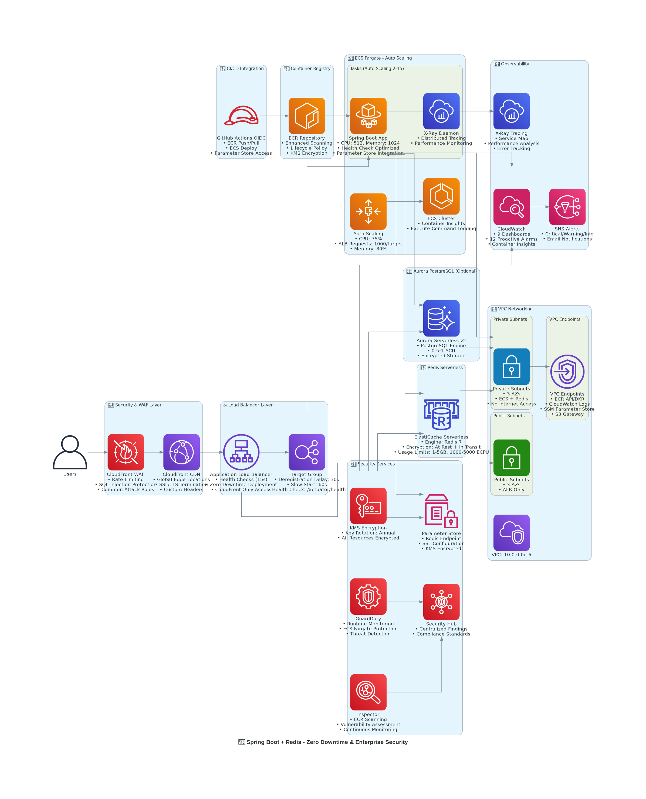

# Spring Boot + Redis POC
# Spring Boot + Redis POC

Aplicação demonstrativa (POC) que mostra como integrar uma aplicação Spring Boot (Java 17) com AWS ElastiCache Serverless Redis. O repositório foca em segurança, observabilidade e deploy em ECS Fargate.



_Figura: Diagrama da arquitetura do POC._

## Visão geral

Este projeto fornece um ponto de partida prático para aplicações em nuvem com cache Redis, deploy em containers e integração com serviços de observabilidade e segurança.

## Estrutura do repositório

- `src/` — código-fonte da aplicação Spring Boot
- `Dockerfile` — build da imagem do container
- `task-definition.json` — exemplo de ECS task definition
- `PROMPT.md` — prompt completo (fonte original para IaP)
- `docs/IaP.md` — versão resumida e canônica do Infrastructure as a Prompt (IaP)

## Infrastructure as a Prompt (IaP)

O material canônico do IaP está em `docs/IaP.md`. Consulte esse arquivo para checklist, parâmetros e comandos de verificação antes de executar qualquer provisionamento automatizado. Sempre execute `explain()` e realize revisão humana do plano.

## Quickstart (local)

1. Build

```bash
mvn -DskipTests package
docker build -t spring-redis-poc:local .
```

2. Run (perfil `simple`)

```bash
java -jar target/spring-redis-poc-1.0.0.jar --spring.profiles.active=simple
```

3. Endpoints úteis

- Health (readiness): `/actuator/health/readiness`
- Teste de Redis: `/api/session/redis/test`

## Perfis

- `serverless` — produção com ElastiCache Serverless
- `resilient` — mecanismos de resiliência
- `simple` — desenvolvimento local

## Boas práticas

- Não execute provisionamento automático sem revisão humana do plano em `docs/IaP.md`.
- Armazene segredos no Parameter Store (SSM) com KMS.
- Habilite ECR image scanning e integre com ferramentas de segurança.

## Contribuição

Abra um PR descrevendo a mudança e assegure que o build passe localmente.

---

Documento final: README limpo e conciso. Para detalhes de infraestrutura, consulte `docs/IaP.md` e `PROMPT.md`.
# Spring Boot + Redis POC

Aplicação demonstrativa (POC) que ilustra a integração de uma aplicação Spring Boot (Java 17) com AWS ElastiCache Serverless Redis. O repositório foca em segurança, observabilidade e deploy em containers (ECS Fargate).


_Diagrama da arquitetura do POC._

## Visão geral

Ponto de partida prático para aplicações nativas em nuvem, com exemplos de:

- Integração com Redis Serverless (cache e sessão)
- Deploy em contêineres (Docker + ECS Fargate)
- Observabilidade (CloudWatch, X-Ray) e segurança (KMS, IAM)

## Estrutura do repositório

- `src/` — código-fonte da aplicação Spring Boot
- `Dockerfile` — instruções para build da imagem do container
- `task-definition.json` — exemplo de ECS task definition
- `PROMPT.md` — prompt original completo (fonte do IaP)
- `docs/IaP.md` — versão canônica e resumida do Infrastructure as a Prompt (IaP)

## Infrastructure as a Prompt (IaP)

O material canônico do IaP foi movido para `docs/IaP.md`. Use-o como referência antes de qualquer provisionamento automatizado: revise parâmetros, execute `explain()` e confirme o plano com revisão humana.

## Quickstart (local)

1. Build

```bash
mvn -DskipTests package
docker build -t spring-redis-poc:local .
```

2. Run (perfil `simple`)

```bash
java -jar target/spring-redis-poc-1.0.0.jar --spring.profiles.active=simple
```

3. Endpoints úteis

- Health (readiness): `/actuator/health/readiness`
- Teste de Redis: `/api/session/redis/test`

## Perfis

- `serverless` — produção com ElastiCache Serverless
- `resilient` — mecanismos de resiliência
- `simple` — desenvolvimento local

## Boas práticas

- Revise `docs/IaP.md` e execute `explain()` antes de provisionar recursos.
- Armazene segredos no Parameter Store (SSM) com KMS.
- Habilite ECR image scanning e integre com ferramentas de segurança.

## Contribuição

Abra um PR descrevendo a mudança e assegure que o build passe localmente.

---

Para detalhes de infraestrutura e checklist completo, consulte `docs/IaP.md` e `PROMPT.md`.

# Spring Boot + Redis POC

Aplicação demonstrativa (POC) que mostra como integrar uma aplicação Spring Boot (Java 17) com AWS ElastiCache Serverless Redis. O repositório foca em segurança, observabilidade e deploy em ECS Fargate.


_Figura: Diagrama da arquitetura do POC._

## Visão geral

Este projeto fornece um ponto de partida prático para aplicações em nuvem com cache Redis, deploy em containers e integração com serviços de observabilidade e segurança.

## Estrutura do repositório

- `src/` — código-fonte da aplicação Spring Boot
- `Dockerfile` — build da imagem do container
- `task-definition.json` — exemplo de ECS task definition
- `PROMPT.md` — prompt completo (fonte original para IaP)
- `docs/IaP.md` — versão resumida e canônica do Infrastructure as a Prompt (IaP)

## Infrastructure as a Prompt (IaP)

O material canônico do IaP está em `docs/IaP.md`. Consulte esse arquivo para checklist, parâmetros e comandos de verificação antes de executar qualquer provisionamento automatizado. Sempre execute `explain()` e realize revisão humana do plano.

## Quickstart (local)

1. Build

```bash
mvn -DskipTests package
docker build -t spring-redis-poc:local .
```

2. Run (perfil `simple`)

```bash
java -jar target/spring-redis-poc-1.0.0.jar --spring.profiles.active=simple
```

# README clean placeholder

Conteúdo final do README sendo recriado. Consulte `docs/IaP.md` para o material de IaP.


